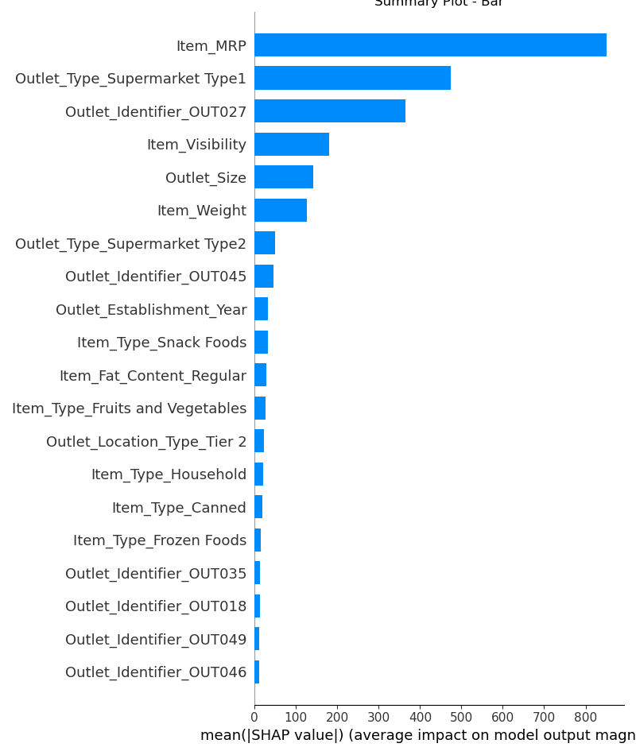
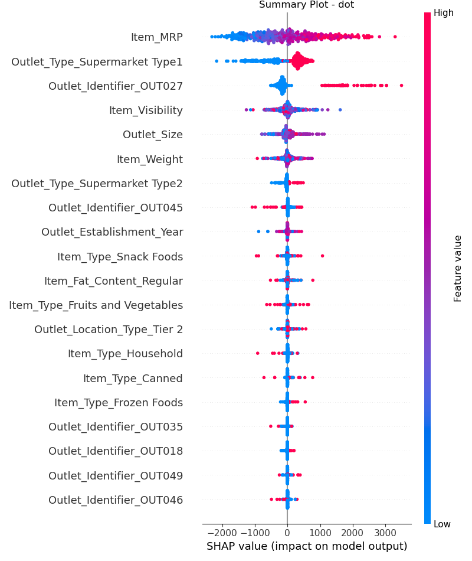

# Supermarket Sales
 
## Linear Regression Coefficients

.
.

- Outlet_Type_Supermarket Type 3, Outlet_Identifier_OUT027, and Outlet_Type_Supermarket Type 1 had the most impact on the model.
    - Outlet_Type_Supermarket Type 3: Being in the Type 3 Supermarket group increases the item outlet sales by 1457.01.
    - Outlet_Identifier_OUT027: Being in the OUT027 group (being sold at OUT027) increases the item outlet sales by 1457.01.
    - Outlet_Type_Supermarket Type 1: Being in the Type 1 Supermarket group increases the item outlet sales by 1141.59.
    
## Decision Tree Feature Importances

.
.

- The 5 most important features were Item_MRP, Item_Visibility, Outlet_Identifier_OUT027, Outlet_Type_Supermarket Type1, and Outlet_Size.
- These features are the most helpful features for this tree-based model to separate the data for predicting the item outlet sales.

## SHAP

### Summary Plot - Bar

.

- The most important features according to SHAP are:
    - Item_MRP
    - Outlet_Type_Supermarket Type 1
    - Outlet_Identifier_OUT027
    - Item_Visibility
    - Outlet_Size
- The most important features according to the model are:
    - Item_MRP
    - Item_Visibility
    - Outlet_Identifier_OUT027
    - Outlet_Type_Supermarket Type 1
    - Outlet_Size
- Both SHAP and the model used Item_MRP as the most important feature for separating the data to predict the item outlet sales.
- The next 4 most important features were the same for SHAP and for the model, but in different orders of importance.
    - SHAP used Outlet_Type_Supermarket Type 1 as the second most important feature, but the model used Item_Visibility as the second most important feature.
    - Both SHAP and the model used Outlet_Identifier_OUT027 as the third most important feature.
    - SHAP used Item_Visibility as the fourth most important feature, but the model used Outlet_Type_Supermarket Type 1 as the fourth most important feature.
    - Both SHAP and the model used Outlet_Size as the fifth most important feature.
- SHAP used Outlet_Type_Supermarket Type 1 as more important than Outlet_Size, but the model used Outlet_Size as more important than Outlet_Type_Supermaret Type 1.

### Summary Plot - dot

.

- The 3 most important features according to SHAP are Item_MRP, Outlet_Type_Supermarket Type 1, and Outlet_Identifier_OUT027.
    - Item_MRP
        - The red values are on the right (positive). The greater the maximum retail price of an item, the higher the model will predict as the item outlet sales.
        - The blue values are on the left (negative). The smaller the maximum retail price of an item, the lower the model will predict as the item outlet sales.
    - Outlet_Type_Supermarket Type 1
        - The red values are on the right (positive). If the item is sold at a Supermarket Type 1, the model will predict higher sales.
        - The blue values are on the left (negative). If the item is sold at a different outlet type, the model will predict lower sales.
    - Outlet_Identifier_OUT027
        - The red values are on the right (positive). If the item is sold at Outlet OUT027, the model will predict higher sales.
        - The blue values are on the left (negative). If the item is sold at any other outlet, the model will predict lower sales.
