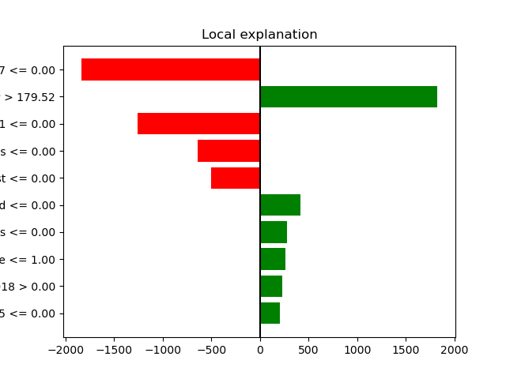
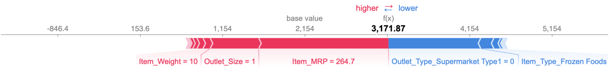
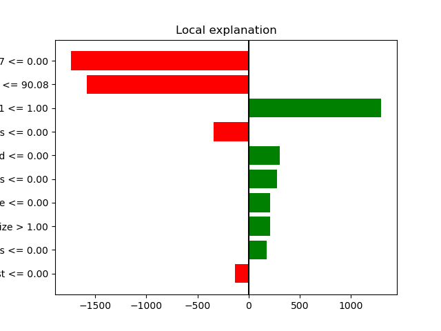
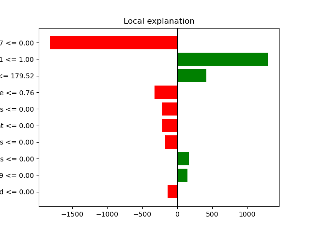

# Supermarket Sales
 
## Linear Regression Coefficients

.
.

- Outlet_Type_Supermarket Type 3, Outlet_Identifier_OUT027, and Outlet_Type_Supermarket Type 1 had the most impact on the model.
    - Outlet_Type_Supermarket Type 3: Being in the Type 3 Supermarket group increases the item outlet sales by 1457.01.
    - Outlet_Identifier_OUT027: Being in the OUT027 group (being sold at OUT027) increases the item outlet sales by 1457.01.
    - Outlet_Type_Supermarket Type 1: Being in the Type 1 Supermarket group increases the item outlet sales by 1141.59.
    
## Decision Tree Feature Importances

.
.

- The 5 most important features were Item_MRP, Item_Visibility, Outlet_Identifier_OUT027, Outlet_Type_Supermarket Type1, and Outlet_Size.
- These features are the most helpful features for this tree-based model to separate the data for predicting the item outlet sales.

## SHAP

### Summary Plot - Bar

.

- The most important features according to SHAP are:
    - Item_MRP
    - Outlet_Type_Supermarket Type 1
    - Outlet_Identifier_OUT027
    - Item_Visibility
    - Outlet_Size
- The most important features according to the model are:
    - Item_MRP
    - Item_Visibility
    - Outlet_Identifier_OUT027
    - Outlet_Type_Supermarket Type 1
    - Outlet_Size
- Both SHAP and the model used Item_MRP as the most important feature for separating the data to predict the item outlet sales.
- The next 4 most important features were the same for SHAP and for the model, but in different orders of importance.
    - SHAP used Outlet_Type_Supermarket Type 1 as the second most important feature, but the model used Item_Visibility as the second most important feature.
    - Both SHAP and the model used Outlet_Identifier_OUT027 as the third most important feature.
    - SHAP used Item_Visibility as the fourth most important feature, but the model used Outlet_Type_Supermarket Type 1 as the fourth most important feature.
    - Both SHAP and the model used Outlet_Size as the fifth most important feature.
- SHAP used Outlet_Type_Supermarket Type 1 as more important than Outlet_Size, but the model used Outlet_Size as more important than Outlet_Type_Supermaret Type 1.

### Summary Plot - dot

.

- The 3 most important features according to SHAP are Item_MRP, Outlet_Type_Supermarket Type 1, and Outlet_Identifier_OUT027.
    - Item_MRP
        - The red values are on the right (positive). The greater the maximum retail price of an item, the higher the model will predict as the item outlet sales.
        - The blue values are on the left (negative). The smaller the maximum retail price of an item, the lower the model will predict as the item outlet sales.
    - Outlet_Type_Supermarket Type 1
        - The red values are on the right (positive). If the item is sold at a Supermarket Type 1, the model will predict higher sales.
        - The blue values are on the left (negative). If the item is sold at a different outlet type, the model will predict lower sales.
    - Outlet_Identifier_OUT027
        - The red values are on the right (positive). If the item is sold at Outlet OUT027, the model will predict higher sales.
        - The blue values are on the left (negative). If the item is sold at any other outlet, the model will predict lower sales.

## Local Explanations

### Item_MRP
- The maximum retail price of an item was the most important feature for both SHAP and the model. It would be helpful to choose an item with low MRP and an item with high MRP.

### Highest MRP

#### Lime tabular explanation

.

- This item had a predicted outlet sales value of 3171.87.
- This item had features associated with higher outlet sales:
    - Item_MRP = 264.72 (> 179.52)
    - Item_Type was not seafood or others
    - Outlet_Size was medium
    - Outlet_Identifier was not OUT018 or OUT045
- This item also had features associated with lower outlet sales:
    - Outlet_Identifier was not OUT027
    - Outlet_Type was not Supermarket Type 1
    - Item_type was not starchy food or breakfast
- 6 of the top 10 most impactful features were associated with higher outlet sales, and 4 were associated with lower outlet sales.

#### Individual Force Plot

.

- The base value is 2154.
- The SHAP value is 3171.87.
- The Item_MRP is the most important feature for this item, and it is pushing the prediction toward a higher value. The Item_MRP for this item is 264.7.
- Outlet_Size and Item_Weight are also pushing the prediction toward a higher value.
- The Outlet_Type_Supermarket and the Item_Type_Frozen Foods are pushing the prediction toward a lower value.

### Lowest MRP

#### Lime tabular explanation

.

- This item had a predicted outlet sales value of 169.78.
- This item had features associated with lower outlet sales:
    - Outlet_Identifier was not OUT027
    - Item_MRP = 32.36 (< 90.08)
    - Item_Type was not soft drink or breakfast
- This item also had features associated with higher outlet sales:
    - Outlet_Type was Supermarket Type 1
    - Item_Type was not seafood, breads, health and hygiene, or hard drinks
    - Outlet_Size was high
- 6 of the top 10 most impactful features were associated with higher outlet sales, and 4 were associated with lower outlet sales.

#### Individual Force Plot

.

- The base value is 2154.
- The SHAP value is 169.78.
- The Item_MRP is the most important feature for this item, and it is pushing the prediction toward a lower value. The Item_MRP for this item is 32.36.
- Outlet_Identifier_OUT027 is also pushing the prediction toward a lower value.
- The Outlet_Type_Supermarket Type 1 is pushing the prediction toward a higher value.

### Outlet_Type_Supermarket Type 1
- The type of outlet was among the most important features for both SHAP and the model. It would be helpful to choose an example from a Type 1 Supermarket.

#### Lime tabular explanation

.

- This item had a predicted outlet sales value of 2451.48.
- This item had features associated with lower outlet sales:
    - Outlet_Identifier was not OUT027
    - Outlet_Size was small
    - Item_Type was not other, meat, bread, or seafood
- This item also had features associated with higher outlet sales:
    - Outlet_Type was Supermarket Type 1
    - Item_MRP was 175.51 (> 140.43)
    - Item_Type was not starchy foods
    - Outlet_Identifier was not OUT019
- 4 of the top 10 most impactful features were associated with higher outlet sales, and 6 were associated with lower outlet sales.

#### Individual Force Plot

.

- The base value is 2154.
- The SHAP value is 2451.48.
- The Outlet_Type_Supermarket Type1 is the most important feature for this item, and it is pushing the prediction toward a higher value. The item is sold at a Supermarket Type1.
- Item_MRP are Item_Typer_Fruits and Vegetables are also pushing the prediction toward a higher value.
- The Outlet_Establishment_Year and the Outlet_Identifier are pushing the prediction toward a lower value.